# Sistema de Solicitações

Sistema web completo para **cadastro, gerenciamento e acompanhamento de solicitações de serviço**, desenvolvido com **Node.js, Express, PostgreSQL, HTML, CSS e JavaScript**.

O projeto foi construído com foco em prática de desenvolvimento **full stack**, cobrindo autenticação, autorização, banco de dados relacional, uploads protegidos, geração de PDFs, envio de e-mails, regras de negócio, filtros, paginação e deploy em produção.

## 🌐 Demonstração online

**Aplicação:** https://www.sistemasolicitacoes.com.br

> O sistema está publicado em produção com domínio próprio, HTTPS e envio de e-mails transacionais pelo domínio `@sistemasolicitacoes.com.br`.

---

## ✨ Principais funcionalidades

### 🔐 Autenticação e usuários

- Cadastro de usuários
- Login com JWT
- Logout com invalidação de token
- Verificação de e-mail por código de 6 dígitos
- Reenvio de código de verificação
- Recuperação de senha por e-mail
- Redefinição de senha
- Controle de acesso baseado em níveis

### 📝 Solicitações

- Cadastro de solicitações
- Visualização individual
- Edição de solicitações
- Exclusão individual
- Exclusão em lote
- Prioridades
- Controle de status
- Associação com responsáveis
- Associação com tipos de serviço
- Busca automática de endereço através do CEP
- Busca por **nome, CPF e ID**
- Filtros por:
  - status;
  - prioridade;
  - responsável;
  - tipo de serviço.
- Combinação simultânea de filtros
- Paginação realizada no backend

### 🖼️ Anexos

- Upload de múltiplas imagens
- Visualização de miniaturas
- Visualização ampliada em modal
- Remoção de anexos
- Proteção dos arquivos por autenticação
- Validação de formato e tamanho dos arquivos
- Limpeza dos arquivos físicos relacionados ao excluir anexos ou solicitações

### 📄 PDFs

- Geração de PDF individual
- Geração de PDF em lote
- Seleção de múltiplas solicitações para impressão
- Controle automático de quebra de página para descrições maiores

### 👑 Administração

- Listagem de usuários
- Alteração de nível de acesso
- Cadastro de responsáveis
- Ativação e desativação de responsáveis
- Associação de um responsável a um usuário existente
- Alteração automática do nível de acesso do usuário vinculado

---

## 🔐 Níveis de acesso

O sistema possui três níveis de acesso:

| Nível | Permissões |
| --- | --- |
| **ADMIN** | Acesso completo ao sistema, incluindo gerenciamento de usuários, responsáveis, solicitações e níveis de acesso |
| **OPERADOR** | Pode criar e editar solicitações, gerenciar anexos, visualizar solicitações e gerar PDFs |
| **VISUALIZADOR** | Possui acesso somente para consulta de solicitações, anexos e documentos |

Todo novo usuário é criado inicialmente como:

```text
VISUALIZADOR
```

Quando um usuário é cadastrado como responsável, seu nível é alterado automaticamente para:

```text
OPERADOR
```

Ao desativar esse responsável, o nível volta para:

```text
VISUALIZADOR
```

As permissões são verificadas no **backend**, através de middlewares de autenticação e autorização. Ocultar botões no frontend não é utilizado como mecanismo de segurança.

---

## 🛠️ Tecnologias utilizadas

### Backend

- Node.js
- Express
- PostgreSQL
- `pg`
- JSON Web Token (`jsonwebtoken`)
- bcrypt
- Multer
- PDFKit
- Resend
- dotenv
- CORS

### Frontend

- HTML5
- CSS3
- JavaScript
- Fetch API

### Infraestrutura e serviços

- Railway
- PostgreSQL
- Resend
- Registro.br
- Domínio próprio
- HTTPS
- DKIM
- SPF
- DMARC

### Ferramentas utilizadas durante o desenvolvimento

- Visual Studio Code
- PostgreSQL
- Postman
- Git
- GitHub

---

# 📸 Screenshots

## Autenticação

### Login

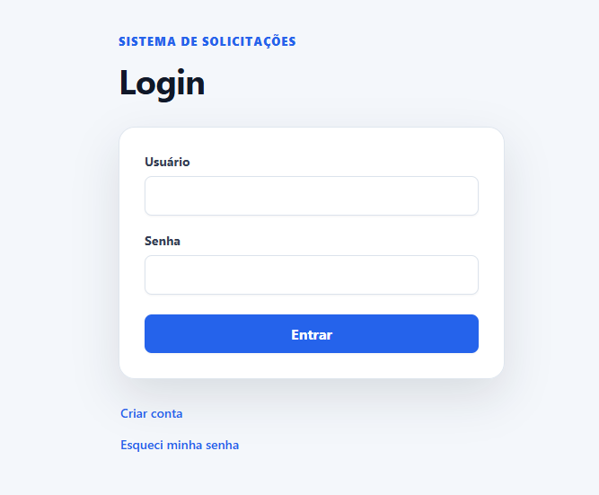

### Cadastro

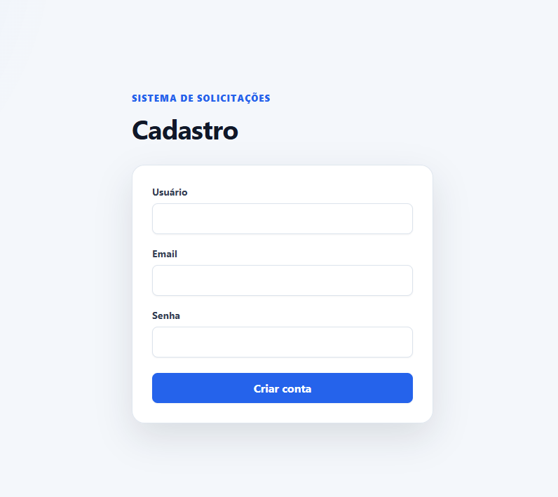

### Verificação de e-mail

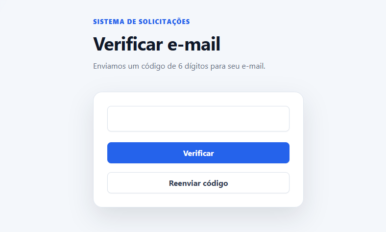

---

## Fluxo principal

### Painel inicial

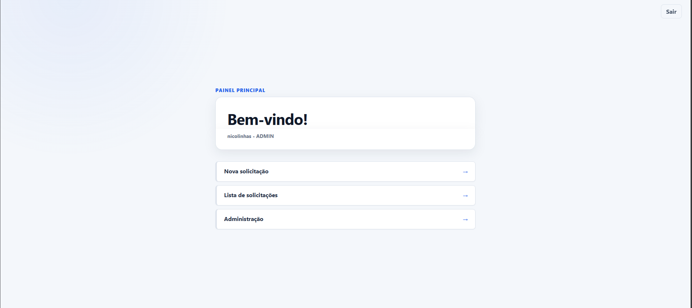

### Nova solicitação

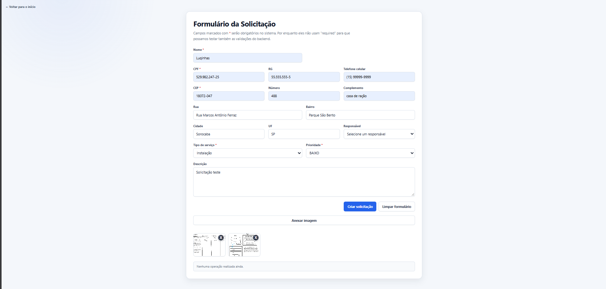

### Listagem com busca, filtros e paginação

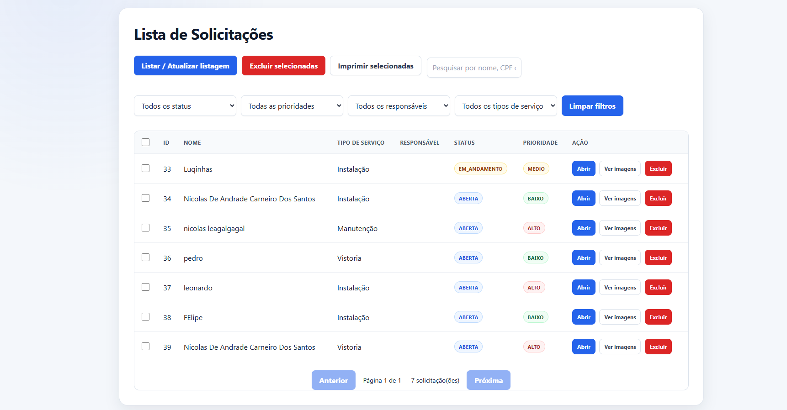

### Visualização e edição de solicitação

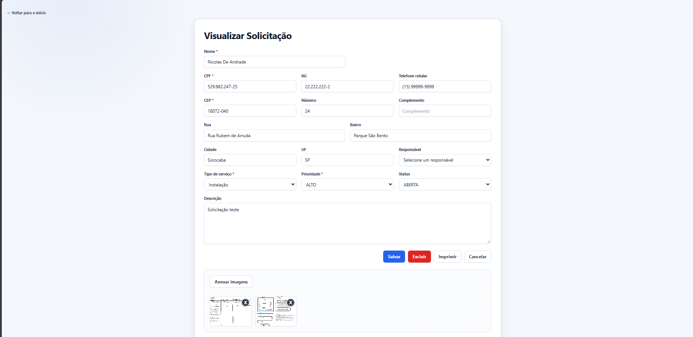

---

## Recursos adicionais

### Visualização de anexos

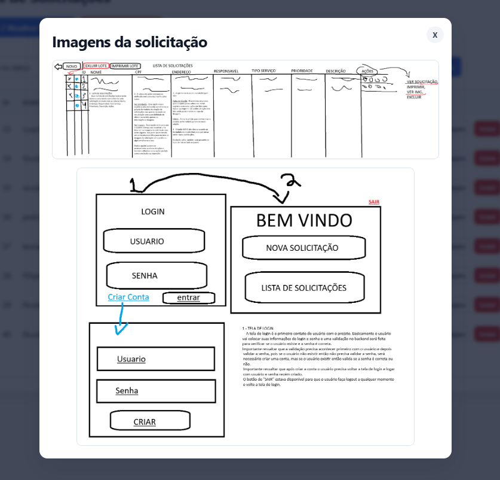

### PDF gerado

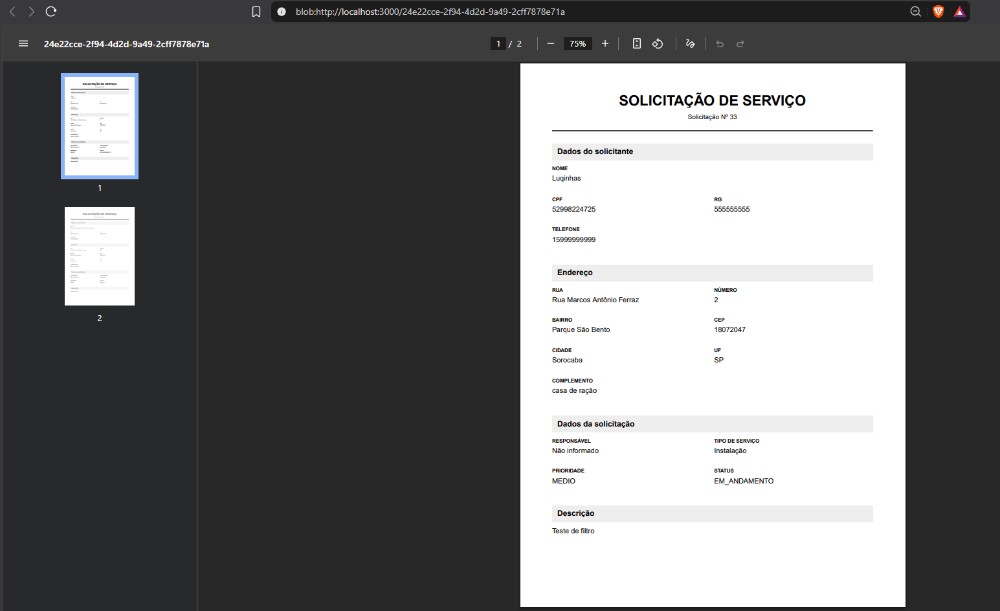

### Área administrativa

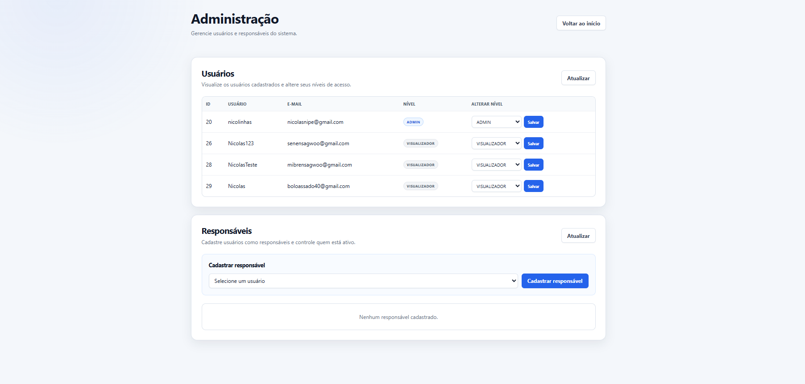

### Recuperação de senha por e-mail

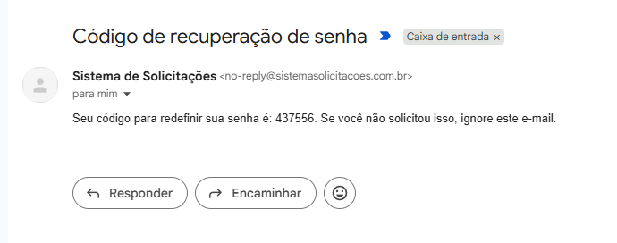

---

## 📁 Estrutura do projeto

```text
SistemaSolicitacoes/
│
├── config/
│   └── database.js
│
├── database/
│   ├── schema.sql
│   └── seed.sql
│
├── public/
│   ├── css/
│   ├── js/
│   ├── administracao.html
│   ├── cadastro.html
│   ├── inicio.html
│   ├── login.html
│   ├── nova-solicitacao.html
│   ├── redefinir-senha.html
│   ├── solicitacao.html
│   ├── solicitacoes.html
│   ├── verificar-email.html
│   └── verificar-email-senha.html
│
├── src/
│   ├── controllers/
│   ├── middlewares/
│   ├── routes/
│   ├── services/
│   └── app.js
│
├── uploads/
│   └── README.md
│
├── .env.example
├── .gitignore
├── package.json
├── package-lock.json
├── README.md
└── server.js
```

---

## 🗄️ Banco de dados

O projeto utiliza **PostgreSQL**.

Principais tabelas:

```text
usuarios
responsaveis
tipos_servico
solicitacoes
anexos
codigos_verificacao
tokens_invalidados
```

Views utilizadas:

```text
view_email_verificacao
view_solicitacoes_registro
```

Relacionamento principal simplificado:

```text
usuarios
   │
   │ 1
   ▼
responsaveis
   │
   │ 1:N
   ▼
solicitacoes
   │
   │ 1:N
   ▼
anexos
```

Um usuário pode ser vinculado a um responsável.

Todo responsável possui um usuário associado, e um responsável pode estar associado a várias solicitações.

---

## 🔑 Autenticação

Após o login, o backend gera um token JWT.

As rotas protegidas esperam o token através do header:

```http
Authorization: Bearer TOKEN
```

O middleware de autenticação verifica:

- existência do token;
- validade;
- expiração;
- invalidação por logout;
- existência atual do usuário.

O nível de acesso é consultado no banco para que alterações de permissão tenham efeito sem depender da emissão de um novo JWT.

---

## 🛡️ Autorização

A autenticação responde:

> Quem é o usuário?

A autorização responde:

> Esse usuário possui permissão para executar esta operação?

Exemplos de níveis utilizados nas rotas:

```text
GET /solicitacoes
→ ADMIN
→ OPERADOR
→ VISUALIZADOR
```

```text
POST /solicitacoes
→ ADMIN
→ OPERADOR
```

```text
DELETE /solicitacoes/:id
→ ADMIN
```

Dessa forma, as permissões continuam protegidas mesmo caso alguém tente realizar requisições diretamente através de ferramentas como Postman.

---

## 👤 Responsáveis

Responsáveis são usuários do sistema vinculados à tabela `responsaveis`.

Quando um administrador cadastra um usuário como responsável:

```text
VISUALIZADOR
     ↓
 OPERADOR
```

Ao desativar esse responsável:

```text
OPERADOR
   ↓
VISUALIZADOR
```

Ao reativá-lo:

```text
VISUALIZADOR
     ↓
 OPERADOR
```

Essas alterações utilizam transações para evitar inconsistências entre as tabelas `usuarios` e `responsaveis`.

Um responsável inativo deixa de aparecer para novas solicitações, mas continua associado às solicitações antigas para preservar o histórico.

---

## 📍 Consulta de CEP

O formulário de solicitação possui integração para consulta de CEP.

Ao informar um CEP válido, o sistema pode preencher automaticamente:

- rua;
- bairro;
- cidade;
- UF.

---

## 🔎 Busca, filtros e paginação

A listagem de solicitações possui:

- busca por nome;
- busca por CPF;
- busca por ID;
- filtro por status;
- filtro por prioridade;
- filtro por responsável;
- filtro por tipo de serviço;
- combinação simultânea dos filtros;
- paginação no backend.

Exemplo de requisição:

```http
GET /solicitacoes?busca=Nicolas&status=ABERTA&prioridade=ALTO&page=1&limit=20
```

A paginação evita carregar todos os registros de uma vez e permite que o backend retorne informações como:

```json
{
  "pagina": 1,
  "limite": 20,
  "total": 53,
  "totalPaginas": 3
}
```

---

## 🖼️ Anexos

As solicitações podem possuir imagens anexadas.

O upload utiliza **Multer** e aplica validações de formato e tamanho.

Os arquivos enviados durante a execução não são versionados pelo Git.

A pasta de uploads não é exposta diretamente como diretório público. A leitura dos anexos passa por rota autenticada, impedindo acesso direto sem autorização.

Ao excluir um anexo ou uma solicitação, o sistema também realiza a limpeza dos arquivos físicos relacionados.

---

## 📄 PDFs

O sistema utiliza **PDFKit** para gerar documentos das solicitações.

### PDF individual

Gera um documento contendo os dados completos de uma única solicitação.

### PDF em lote

Permite selecionar várias solicitações na listagem e gerar um único documento contendo todas elas.

O sistema também controla automaticamente quebras de página para descrições maiores.

---

## ✉️ E-mails transacionais

O sistema utiliza **Resend** para envio de e-mails.

Os e-mails são usados em:

- verificação de conta;
- reenvio de código;
- recuperação de senha.

Em produção, os e-mails são enviados através do domínio:

```text
@sistemasolicitacoes.com.br
```

Exemplo de remetente:

```text
Sistema de Solicitações <no-reply@sistemasolicitacoes.com.br>
```

O domínio foi autenticado utilizando:

- DKIM;
- SPF;
- DMARC.

---

## ☁️ Deploy e produção

A aplicação está publicada utilizando **Railway**.

Principais elementos da infraestrutura:

- aplicação Node.js em produção;
- banco PostgreSQL;
- domínio próprio;
- HTTPS;
- envio de e-mails por Resend;
- autenticação DNS do domínio;
- armazenamento dos anexos durante a execução da aplicação.

### URL pública

```text
https://www.sistemasolicitacoes.com.br
```

---

## 🔒 Segurança

Algumas medidas aplicadas no projeto:

- senhas armazenadas com hash usando bcrypt;
- autenticação JWT;
- expiração de tokens;
- invalidação de JWT durante logout;
- verificação de permissões no backend;
- validação dos dados recebidos;
- queries parametrizadas com PostgreSQL;
- níveis de acesso consultados diretamente no banco;
- anexos protegidos por autenticação;
- validação de tipo e tamanho dos uploads;
- proteção contra níveis de acesso inválidos;
- proteção contra remoção do último administrador;
- variáveis sensíveis armazenadas no `.env`;
- `.env` ignorado pelo Git.

---

# 🚀 Executando localmente

## Pré-requisitos

- Node.js
- npm
- PostgreSQL

O projeto foi desenvolvido utilizando:

```text
Node.js 24
PostgreSQL 18
```

Versões diferentes e compatíveis também podem funcionar.

---

## 1. Clonar o repositório

```bash
git clone https://github.com/NinicDev/SistemaSolicitacoes.git
```

```bash
cd SistemaSolicitacoes
```

---

## 2. Instalar as dependências

```bash
npm install
```

---

## 3. Criar o banco

```sql
CREATE DATABASE sistema_solicitacoes;
```

Depois execute:

```bash
psql -U postgres -d sistema_solicitacoes -f database/schema.sql
```

E em seguida:

```bash
psql -U postgres -d sistema_solicitacoes -f database/seed.sql
```

O `seed.sql` adiciona os tipos de serviço iniciais:

```text
Instalação
Manutenção
Vistoria
```

Nenhum usuário, senha, solicitação ou dado pessoal utilizado durante o desenvolvimento é distribuído junto ao banco.

---

## 4. Configurar variáveis de ambiente

Crie um arquivo:

```text
.env
```

com base no `.env.example`.

Exemplo:

```env
DB_HOST=localhost
DB_PORT=5432
DB_USER=postgres
DB_PASSWORD=sua_senha_do_postgresql
DB_NAME=sistema_solicitacoes

JWT_SECRET=seu_segredo_jwt

RESEND_API_KEY=sua_chave_do_resend
EMAIL_REMETENTE="Sistema de Solicitações <no-reply@seudominio.com.br>"

PORT=3000
```

O `.env` contém informações privadas e **não deve ser enviado ao GitHub**.

---

## 5. Criar o primeiro administrador

Todos os novos usuários são cadastrados inicialmente como:

```text
VISUALIZADOR
```

Para criar o primeiro administrador:

1. Cadastre um usuário normalmente.
2. Verifique o e-mail.
3. Execute no PostgreSQL:

```sql
UPDATE usuarios
SET nivel_acesso = 'ADMIN'
WHERE email = 'seu@email.com';
```

Depois disso, entre novamente no sistema.

Os próximos usuários poderão ser gerenciados através da própria interface administrativa.

---

## 6. Executar o projeto

Produção / execução normal:

```bash
npm start
```

Desenvolvimento com Nodemon:

```bash
npm run dev
```

Por padrão, o backend utiliza:

```text
http://localhost:3000
```

Caso a variável `PORT` seja fornecida pelo ambiente, ela será utilizada automaticamente.

---

## 🧪 Testes realizados

Durante o desenvolvimento, as rotas da API foram testadas utilizando Postman e também através dos fluxos completos da interface.

Foram testados cenários como:

- autenticação válida e inválida;
- token ausente;
- token expirado;
- permissões entre ADMIN, OPERADOR e VISUALIZADOR;
- criação e edição de solicitações;
- exclusão individual e em lote;
- upload e exclusão de anexos;
- geração de PDFs;
- filtros;
- paginação;
- alteração do nível de acesso;
- ativação e desativação de responsáveis;
- códigos de verificação;
- recuperação de senha;
- validações de campos.

---

## 🎯 Objetivo do projeto

Este projeto foi desenvolvido para consolidar conhecimentos de desenvolvimento web full stack, trabalhando de forma integrada:

- frontend;
- backend;
- APIs REST;
- banco de dados relacional;
- autenticação;
- autorização;
- segurança;
- uploads;
- geração de documentos;
- serviços externos;
- deploy em produção.

---

## 👨‍💻 Autor

Desenvolvido por **Nicolas Andrade**.

GitHub:

[NinicDev](https://github.com/NinicDev)

---

## 📄 Licença

Este projeto foi desenvolvido para fins de estudo, prática e portfólio.
